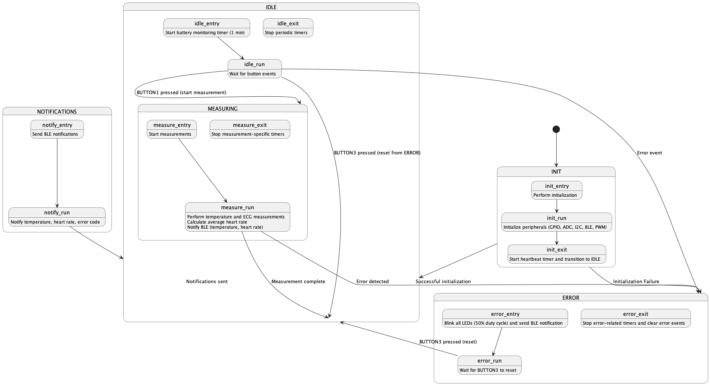

# Final Project: ECG & Temperature Monitor with BLE

**You are allowed to work in groups of up to 3 students for this final project.**

* Have one person (referred to as the Team Leader below) in your group fork this repository into their userspace.
* All other team members should fork the Team Leader's repository.
* Each team member should add Dr. Palmeri and all of the class teaching assistants as Maintainers to their repository.
* Questions should be asked exclusively through GitLab Issues.
* All team members should contribute to the final project, and this equal contribution should be reflected through the git history.
* All team members should create Merge Requests to the Team Leader's repository for their contributions throughout the project.
* If you work as a team, the only way for everyone to get credit is through git commits and merge requests that reflect individual user contributions.  **You will not be able to say "we worked on this together" without git commits and merge requests to back it up to receive credit for working on the project.**
* Inequalities in contributions will be reflected in the **individual** final project grades.
* :scream: If collaborating with other students in the class stresses you out, or you worry about effort inequity, then I would recommend working alone.

## Git Version Control Management

* Use best version control practices throughout the development of your firmware.
* Use branches for development and merge into your `main` branch when the code is stable.
* Commit often with meaningful commit messages.
* Merge Requests to the Team Leader's repository should be made when focused, but functional, changes are complete.
* Using libraries will help avoid conflicts in `main.c` that will occur if everyone writes code in the same file.
* Be careful collaborating with Jupyter notebooks; they don't play well with merges.  You may want each team member to perform testing in separate notebooks that you manually combine at the end of the project, or you may divide up the labor of testing and analysis between team members.

## Best Coding Practices

* Use best coding practices throughout the development of your firmware.
* Functions should be short and do one thing.  They should return an exit code that is checked in the calling function, indicating success or failure.
* MACROS!  Avoid hard-coded values in your code.
* Use structs to organize related data.
* Use libraries for code that could be re-used in other projects.
* Use the `LOGGING` module to log errors, warnings, information and debug messages.
* You should not have any compiler/build warnings.  The CI script will build against `v2.6.2` of the Zephyr SDK; using `v2.7.0` will cause build errors related to the SMF module.

## Firmware Functional Specifications

* Write all firmware using the state machine framework.
  * Do all device initialization in an `INIT` state.
  * Have an `IDLE` state when the device isn't making any measurements.
  * Have an `ERROR` state if any error exit codes are returned from any functions.
    * An error condition should post an error-related event that causes the device to enter the `ERROR` state.
    * The error code should specify the error condition that caused the device to enter the `ERROR` state.  For example, you may choose to have a bit array that can capture multiple error conditions.
    * A BLE notification should be sent with the error code (see BLE custom service/characteristic below).
  * Implement states of your choosing for the following measurements, calculations and BLE communications.
* Have a heartbeat `LED0` that blinks every 1 second in all states.
* Implement functionality to measure a battery voltage (0-3.7 V) using `AIN0`:
  1. When the device first powers on, and then
  1. Every 1 minute thereafter, but only when in the `IDLE` state.
* Have the brightness of `LED1` linearly modulated by the percentage of the battery level.
* Implement functionality to make two measurements after pressing `BUTTON1`:
  1. Read temperature with your MPR9808 sensor (in degrees Celsius).
  1. Calculate the average heart rate (40-200 BPM) using 25-30 seconds of an ECG signal (ranging from -500--500 mV) from the function generator
* Pressing `BUTTON1` during the measurements should post an error and go to the `ERROR` state.
* Blink `LED2` at the average heart rate after the measurements are complete.
* Have Bluetooth notifications after the measurements are complete and data have been processed, using the BLE services and characteristics described below.
  * Configure the **DIS (Device Information Service)** to report the device model as your Team Name (come up with something fun).
  * Set the **BAS (Battery Service)** to report the battery level of your device.  (This isn't actually a battery level, but we're using the `AIN0` measurement as a surrogate for a battery level.)
  * Set the **Heart Rate Service** to report the average heart rate.  (See Resources section below.)
  * Setup a custom service with the following custom characterisitics:
    * `Temperature` for the I2C temperature sensor data in degrees Celcius.
    * `Error Code` for the error code that caused the device to enter the `ERROR` state.
* `BUTTON2` should clear a blinking `LED2`, and if `LED2` is not blinking because a measurement hasn't been taken, then it should log a warning (`LOG_WRN()`) as to why it appears nothing happened.
* `BUTTON3` should be used to reset the device from the `ERROR` state and return to the `IDLE` state.
* Use timers, kernel events, work queues, threads and any other Zephyr RTOS features as needed to implement the above functionality.

## BLE Server

Implement Bluetooth connection, notifications and reading to the [nRF Connect](https://www.nordicsemi.com/Products/Development-tools/nrf-connect-for-mobile) mobile app.  

## State Diagram

Generate a detailed state diagram that all states, events and actions for your firmware.  A starter diagram is provided in the `state_diagram.puml` file, along with its rendering below.  You should add states, events and actions as needed to fully describe the functionality of your firmware.

## Testing & Verification

Complete the testing analysis described in [testing/final_project.ipynb](testing/final_project.ipynb) to verify the accuracy of your firmware.

## Extra Credit

* :star: Implement signal processing to get the ECG measurement to work on a noisy signal with low-frequency "DC drift".  This will be graded based on the quality of the implementation and the ability to accurately measure the average heart rate.
* :star: Implement a low-level I2C driver for the MPR9808 temperature sensor.  This does not mean using the Zephyr I2C driver, but rather implementing the I2C communication protocol yourself.  This will be graded based on the quality of the implementation and the ability to read the temperature sensor data, which you can verify using the `SENSOR` implementation.  **You are not allowed to just reverse engineer the Zephyr I2C driver or use CoPilot or another AI tool to generate the driver.  You must do this based on the datasheet for this sensor.**

*See what these extra credit opportunities can do for your grade below!*

## Grading

* This final project is worth 75% of your grade.  Absolutely no late submissions will be accepted.
* Git version control will be graded based on best practices.
* Firmware will be graded based on all best practices taught throughout the semester.
* Code organization and coding best practices will be graded.
* State diagram will be graded based on completeness, accuracy and ease of interpretation.
* Testing and analysis technical report will be graded based on presentation, completeness, and accuracy.
* Extra credit will only be considered after all required functionality is implemented and working correctly.
  * Getting the ECG measurement to work on a noisy signal with low-frequency "DC drift" will forgive all late penalties for labs this semester.  (Applies to all team members.)
  * Implementing an I2C low-level driver for the temperature sensor allow the final project to count exclusively for your final grade if it is greater than your final grade with the labs.  (Applies to all team members.)

## What to Submit

* Make sure that all of your development branches have been merged into `main` in your Team Leader's repository.
* Create an annotated tag called `v1.0.0` to mark the commit that you want to be graded.  If you fix any bugs after creating this tag, you can create another tag called `v1.0.1`, etc.  Your latest tag will be the one that is graded.
* Create an Issue in your repository with the title "Final Project Submission", and assign it to Dr. Palmeri.
* **All repositories will be cloned at the due date/time for grading.  Absolutely no changes will be accepted after this time.**
* Your team must schedule a time to do a live demo of your device with Dr. Palmeri before the due date of this assignment.  Your team will be asked questions during this demo.

## Resources

### Heart Rate Service (GATT)
* https://docs.zephyrproject.org/latest/samples/bluetooth/peripheral_hr/README.html
* https://github.com/zephyrproject-rtos/zephyr/tree/main/samples/bluetooth/peripheral_hr
* https://docs.zephyrproject.org/latest/doxygen/html/group__bt__hrs.html